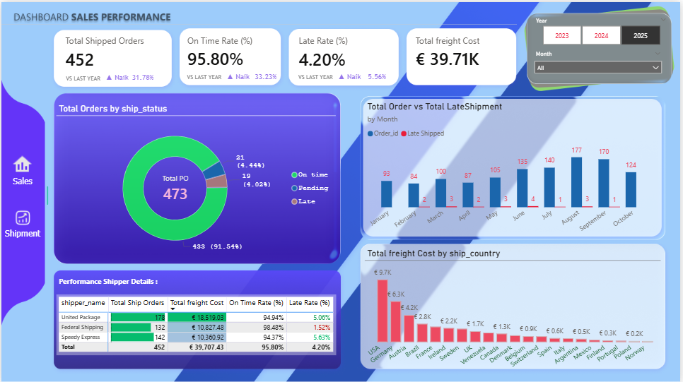

# Dashboard Sales & Shipment performance
Mini Project Dashboard Sales Performance

# Deskripsi Dashboard
Project ini adalah mini project dari bootcamp BI Analyst yaitu membuat dashboard untuk monitoring kinerja penjualan & pengiriman tahun berjalan (YTD) pada perusahaan ritel.

# Sumber dataset 
Convert data csv atau query sql dari database/SQL server (postgresql) milik digital skola :
- data order
- data order_details
- data products
- data customer
- data shipment
- data shipper

# Tools 
- sql
- power BI

# Dashboard Overview
## Page Sales

## Page Shipment

# Key Insight
### SALES PERFORMANCE INSIGHT

1️⃣ Revenue & Order Growth Solid

- Total Sales: $753.05K (+52.18% YoY)
- Total Orders: 473 (+37.90% YoY)
- Total Quantity: $28.60K (+31.05% YoY)
- AOV: $1.59K (+10.36% YoY)

📌 Insight :
Pertumbuhan revenue lebih cepat dibanding pertumbuhan order → strategi pricing, bundling, atau upselling berjalan efektif. Kenaikan AOV menunjukkan kualitas order meningkat, bukan hanya volume.

2️⃣ Seasonal Trend & Volatility

Penjualan turun signifikan di April, lalu meningkat konsisten hingga puncak di September ($130K).
Oktober mengalami sharp drop, meskipun masih di atas beberapa bulan awal.

📌 Insight:
Ada pola musiman kuat (Q3 peak). Penurunan di Oktober bisa mengindikasikan:
efek pasca peak season, keterbatasan stok, atau bottleneck pengiriman (terkonfirmasi di dashboard shipment).

3️⃣ Sales Contributor Analysis (Employee)

- Top performer menyumbang >20% total sales.
- Beberapa sales dengan order tinggi tapi AOV rendah.
- Ada gap performa antar sales yang cukup besar.

📌 Insight:
Perlu Segmentasi Sales Performance :
- High Order – Low AOV → fokus upselling
- Low Order – High AOV → fokus lead generation

4️⃣ Product & Market Concentration Risk

Price band €20–€50 adalah kontributor terbesar (~€0.34M).
USA & Germany menyumbang mayoritas revenue.

📌 Insight:
Bisnis masih terkonsentrasi pada mid-price segment & beberapa negara utama.
Risiko: shock pasar / regulasi → revenue langsung terdampak.

## 🚚 SHIPMENT PERFORMANCE INSIGHT
5️⃣ Service Level Sangat Baik, Tapi Ada Early Warning

- On-Time Rate: 95.80%
- Late Rate: 4.20%
- Total Shipped Orders: 452 (+31.78%)

📌 Insight:
Secara SLA masih sangat sehat, namun tren late shipment meningkat seiring volume order naik → potensi future risk jika demand terus tumbuh.

6️⃣ Late Shipment Spike di Mid-Year

Keterlambatan mulai meningkat di Mei–Juni, berbarengan dengan kenaikan order. Puncak order di Agustus–September → mulai muncul tekanan distribusi.

📌 Insight:
Masalah bukan vendor tunggal, tapi capacity planning. Sistem shipment belum sepenuhnya scalable terhadap growth.

7️⃣ Freight Cost Inefficiency

- Total Freight Cost: €39.71K
- Biaya tertinggi: USA, Germany, Australia
- Cost tidak selalu linear dengan jumlah order.

📌 Insight:
Ada inefisiensi rute atau carrier selection, khususnya di negara dengan volume tinggi.
Potensi saving melalui:
- renegosiasi kontrak,
- shipment consolidation,
- atau zone-based pricing.

8️⃣ Carrier Performance Comparison

Semua shipper memiliki on-time rate di atas 94%. Namun late rate dan freight cost berbeda signifikan.

📌 Insight:
Decision saat ini belum cost-performance optimized. Idealnya carrier dipilih berdasarkan Cost per On-Time Shipment, bukan hanya SLA.
